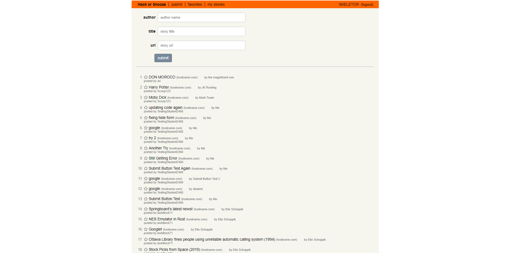

# Hacker News
Hacker News "Clone" app. This app utilizes an API developed by USF called "Hack-Or-Snooze." I was expected to utlize this API to make AJAX "get" and "post" requests to update a Hacker News clone. All posts on this app are thus generated from the Hack-Or-Snooze API and are thus public.

In this app, users can create a login, submit stories, "favorite" stories, filter by favorited and by submitted stories, and delete submitted stories.

     

## My Contribution:
I was provided with a skeletal starter code for the app, including the basic styling and layout. I was expected to make AJAX requests, "get" and "post" requests, interact with the API, and develop functionality for logging in / logging out, submitting stories, favoriting, filtering by favorites / submitted, and delete submitted stories.
